# RAG Chatbot

<p align="center">
  <strong>Retrieval-Augmented Generation Chatbot</strong><br>
  <em>Chatbot cerdas yang menjawab pertanyaan berdasarkan dokumen PDF</em>
</p>

---

## Daftar Isi

1. [Ikhtisar Proyek](#1-ikhtisar-proyek)
2. [Arsitektur Sistem](#2-arsitektur-sistem)
3. [Teknologi & Library yang Digunakan](#3-teknologi--library-yang-digunakan)
4. [Struktur Proyek](#4-struktur-proyek)
5. [Alur Kerja RAG Pipeline](#5-alur-kerja-rag-pipeline)
6. [Fungsi-Fungsi dalam `rag_chatbot.py`](#6-fungsi-fungsi-dalam-rag_chatbotpy)
7. [Fungsi-Fungsi dalam `web_app.py`](#7-fungsi-fungsi-dalam-web_apppy)
8. [Antarmuka Web (`templates/index.html`)](#8-antarmuka-web-templatesindexhtml)
9. [Penjelasan Detail Teknik](#9-penjelasan-detail-teknik)
   - 9.1 [Chunking Strategy](#91-chunking-strategy)
   - 9.2 [Embedding Model](#92-embedding-model)
   - 9.3 [Vector Store (FAISS)](#93-vector-store-faiss)
   - 9.4 [Strict Grounding](#94-strict-grounding)
   - 9.5 [Source Citation](#95-source-citation)
10. [Cara Instalasi & Konfigurasi](#10-cara-instalasi--konfigurasi)
11. [Cara Menjalankan](#11-cara-menjalankan)
12. [Endpoint API](#12-endpoint-api)
13. [Troubleshooting](#13-troubleshooting)

---

## 1. Ikhtisar Proyek

**RAG Chatbot** adalah aplikasi berbasis **Retrieval-Augmented Generation (RAG)** yang memungkinkan pengguna untuk bertanya tentang isi dokumen PDF dan mendapatkan jawaban yang **hanya berdasarkan konten dokumen tersebut** — tanpa halusinasi atau jawaban dari luar konteks.

### Fitur Utama

| Fitur | Deskripsi |
|-------|-----------|
| **Strict Grounding** | Chatbot hanya menjawab berdasarkan isi PDF. Jika tidak ada jawaban di dokumen, ia akan berkata "Saya tidak tahu" |
| **Source Citation** | Setiap jawaban disertai sumber: nama file, nomor halaman, dan cuplikan teks |
| **Persistent Index** | Index FAISS disimpan ke disk. Re-index hanya dilakukan sekali |
| **Dua Mode** | Tersedia mode **Terminal** dan mode **Web** (Flask) |
| **Biaya Nol** | Embedding gratis (lokal) + LLM gratis (Groq) |
| **Responsive Web** | Antarmuka web modern yang responsif di desktop dan HP |

---

## 2. Arsitektur Sistem

### Diagram Arsitektur Sistem

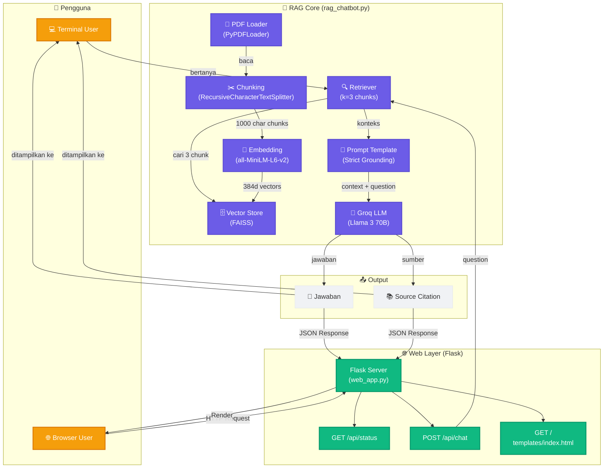

### Alur Data secara Singkat

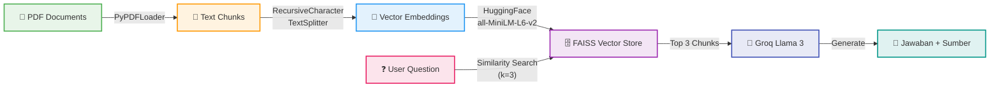

---

## 3. Teknologi & Library yang Digunakan

| No | Library | Versi | Fungsi |
|----|---------|-------|--------|
| 1 | `langchain` | ≥0.3.0 | Framework utama RAG — menghubungkan semua komponen |
| 2 | `langchain-groq` | ≥0.2.0 | Integrasi dengan Groq API untuk akses Llama 3 |
| 3 | `langchain-huggingface` | ≥0.1.0 | Integrasi dengan HuggingFace Embeddings |
| 4 | `langchain-community` | ≥0.3.0 | Community integrations (FAISS, PDF Loaders, dll.) |
| 5 | `langchain-text-splitters` | ≥0.3.0 | Text splitter (dipisah dari langchain core di v0.3.x) |
| 6 | `sentence-transformers` | ≥3.0.0 | Model embedding `all-MiniLM-L6-v2` (lokal, gratis) |
| 7 | `faiss-cpu` | ≥1.9.0 | Vector store untuk similarity search |
| 8 | `pypdf` | ≥5.0.0 | Membaca file PDF |
| 9 | `flask` | ≥3.0.0 | Web framework untuk antarmuka HTML |
| 10 | `python-dotenv` | ≥1.0.0 | Load konfigurasi dari file `.env` |

### Model AI yang Digunakan

| Komponen | Model/Provider | Detail |
|----------|---------------|--------|
| **LLM** | Groq — `llama-3.3-70b-versatile` | Model Llama 3.3 70B, dijalankan di infrastruktur Groq (inferensi super cepat) |
| **Embedding** | `sentence-transformers/all-MiniLM-L6-v2` | Model embedding lokal ~80MB, 384 dimensi, gratis selamanya |
| **Vector Store** | FAISS (Facebook AI Similarity Search) | Index vektor lokal, disimpan di disk |

### Diagram Keterkaitan Library

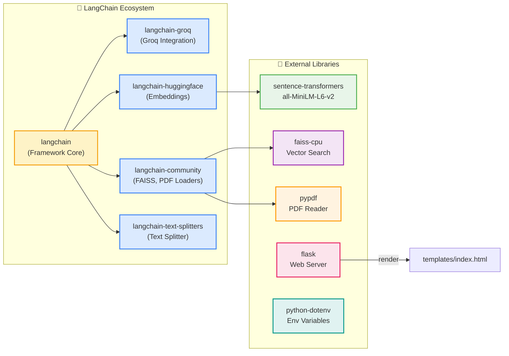

---

## 4. Struktur Proyek

```text
rag-chatbot/
├── data/
│   ├── contoh.pdf
│   └── (PDF files here)
├── faiss_index/
│   ├── index.faiss        # File index vektor biner
│   └── index.pkl          # File pickle metadata
├── screenshots/           # (Testing evidence)
├── templates/
│   └── index.html         # Antarmuka web chatbot
├── rag_chatbot.py         # Kode utama RAG - mode terminal
├── web_app.py             # Web interface Flask
├── requirements.txt       # Daftar dependency Python
├── .env.example           # Contoh environment variables
└── README.md 
```

---

## 5. Alur Kerja RAG Pipeline

### 5.1. Offline: Indexing Pipeline

Langkah ini dilakukan **sekali** (saat pertama kali dijalankan atau saat `reset`).

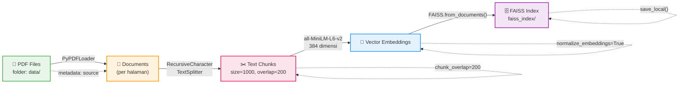

#### Detail Proses Indexing

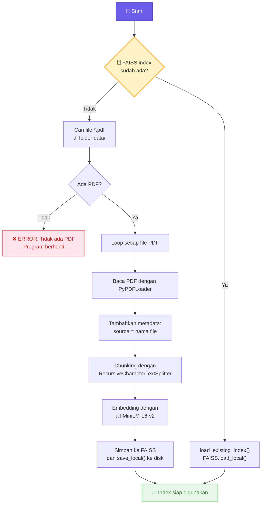

### 5.2. Online: Query Pipeline

Langkah ini dilakukan **setiap kali** user mengirim pertanyaan.

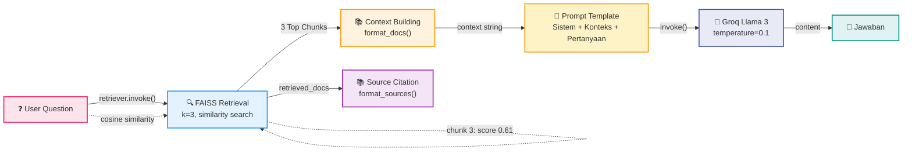

### 5.3. Sequence Diagram: Interaksi Q&A

Berikut adalah diagram urutan interaksi antara komponen saat user mengirim pertanyaan:

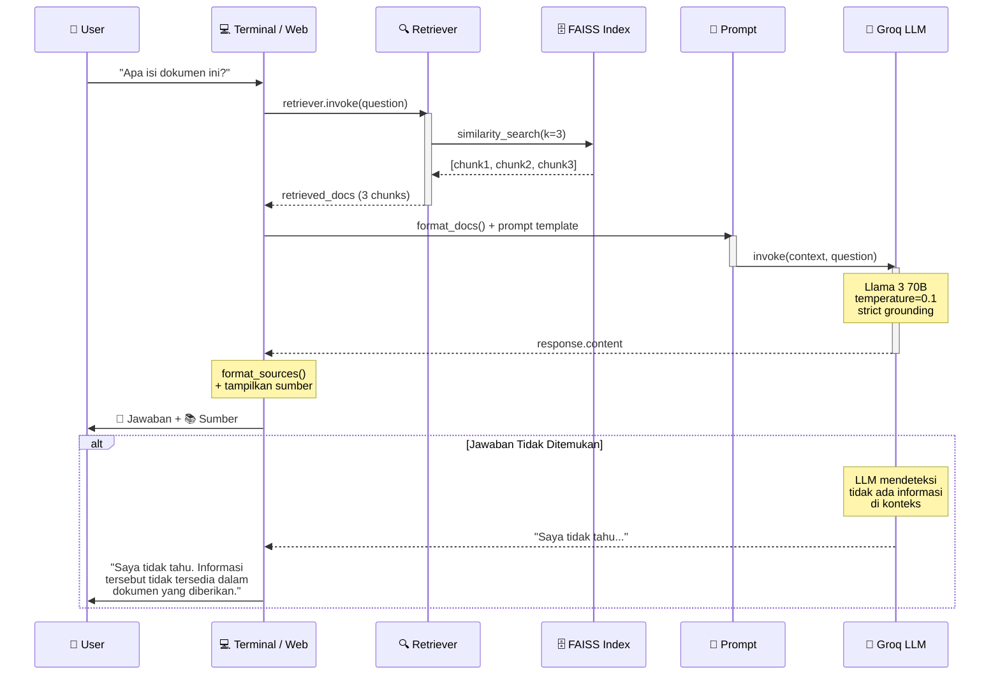

### Alur Detail:

1. **User mengirim pertanyaan**
2. **FAISS melakukan similarity search** — mencari 3 chunk paling relevan dari index vektor
3. **Context dibangun** — ketiga chunk digabung menjadi konteks
4. **Prompt dikirim ke Groq LLM** — berisi instruksi SISTEM + konteks + pertanyaan
5. **LLM menghasilkan jawaban** — berdasarkan konteks, dengan strict grounding
6. **Sumber ditampilkan** — file, halaman, dan cuplikan dari tiap chunk

---

## 6. Fungsi-Fungsi dalam `rag_chatbot.py`

File ini adalah **inti dari project**. Berisi seluruh logika RAG dari hulu ke hilir.

### 6.1. Konfigurasi Global

#### `LLM`
- **Tipe**: `ChatGroq` (dari `langchain_groq`)
- **Model**: `llama-3.3-70b-versatile`
- **Temperature**: `0.1` — suhu rendah agar jawaban lebih faktual dan konsisten
- **max_tokens**: `1024` — batasi panjang jawaban
- **Fungsi**: Objek LLM yang digunakan untuk menghasilkan jawaban berdasarkan konteks

#### `EMBEDDING_MODEL`
- **Tipe**: `HuggingFaceEmbeddings` (dari `langchain_huggingface`)
- **Model**: `sentence-transformers/all-MiniLM-L6-v2`
- **Device**: `cpu`
- **normalize_embeddings**: `True` — penting agar cosine similarity akurat
- **Dimensi**: 384
- **Fungsi**: Mengubah teks menjadi vektor 384 dimensi

#### `TEXT_SPLITTER`
- **Tipe**: `RecursiveCharacterTextSplitter` (dari `langchain_text_splitters`)
- **chunk_size**: `1000` karakter
- **chunk_overlap**: `200` karakter (20%)
- **separators**: `["\n\n", "\n", ".", " ", ""]`
- **Fungsi**: Memotong teks panjang menjadi chunk-chunk kecil yang bisa di-embed

### 6.2. Diagram Alur Fungsi Utama

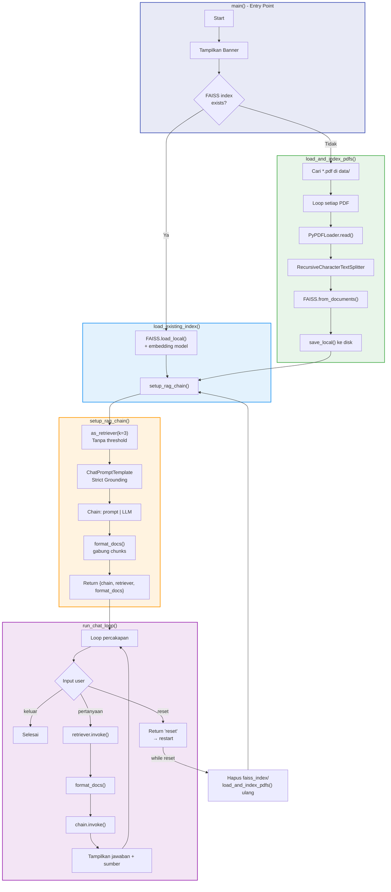

### 6.3. Fungsi-Fungsi Utama

---

#### `load_and_index_pdfs() -> FAISS`

**Deskripsi**: Fungsi utama untuk membaca semua PDF dari folder `data/`, melakukan chunking, embedding, dan menyimpan ke FAISS vector store.

**Alur**:
1. Mencari semua file `*.pdf` di folder `data/` menggunakan `Path.glob()`
2. Jika tidak ada PDF, tampilkan error dan hentikan program
3. Loop setiap file PDF:
   - Buat objek `PyPDFLoader` dengan path file
   - Panggil `loader.load()` untuk membaca semua halaman
   - Tambahkan metadata `source` = nama file ke setiap dokumen
4. Semua dokumen digabung ke dalam `all_documents`
5. Panggil `TEXT_SPLITTER.split_documents(all_documents)` untuk memotong teks
6. Buat FAISS vector store dengan `FAISS.from_documents(chunks, EMBEDDING_MODEL)`
7. Simpan index ke disk dengan `vector_store.save_local()`
8. Kembalikan `vector_store`

**Return**: `FAISS` — vector store yang siap digunakan

**Dipanggil ketika**:
- Index FAISS belum ada di disk
- User mengetik `reset` di terminal
- Server Flask start dan index belum ada

---

#### `load_existing_index() -> FAISS`

**Deskripsi**: Memuat FAISS index yang sudah ada dari disk.

**Alur**:
1. Panggil `FAISS.load_local(path, embedding_model, allow_dangerous_deserialization=True)`
2. Parameter `allow_dangerous_deserialization=True` diperlukan karena FAISS menggunakan pickle untuk metadata

**Return**: `FAISS` — vector store yang dimuat dari disk

**Dipanggil ketika**: Index FAISS sudah ada di folder `faiss_index/`

---

#### `setup_rag_chain(vector_store: FAISS) -> dict`

**Deskripsi**: Membuat RAG chain yang terdiri dari retriever, prompt template, dan chain LLM.

**Parameter**:
- `vector_store` — objek FAISS yang sudah siap

**Yang dilakukan**:
1. **Membuat Retriever**:
   - `vector_store.as_retriever(search_kwargs={"k": 3})`
   - `k=3` — ambil 3 chunk teratas berdasarkan similarity
   - **Tanpa** `score_threshold` — karena prompt SUDAH mengatur strict grounding

2. **Membuat Prompt Template**:
   - Menggunakan `ChatPromptTemplate.from_messages()`
   - Berisi pesan `system` yang menginstruksikan LLM untuk:
     - HANYA menjawab berdasarkan konteks dokumen
     - JANGAN menggunakan pengetahuan umum sendiri
     - Jika tidak ada jawaban di konteks, WAJIB bilang "Saya tidak tahu"
     - Gunakan bahasa Indonesia yang baik dan benar

3. **Membuat Chain**:
   - `chain = prompt_template | LLM`
   - Pipe operator dari LangChain Expression Language (LCEL)

4. **Membuat Fungsi `format_docs(docs)`**:
   - Fungsi lokal untuk menggabungkan dokumen menjadi string
   - Dipisah dengan `\n\n---\n\n`

**Return**: Dictionary dengan key:
- `"chain"` — LangChain chain (Prompt → LLM)
- `"retriever"` — FAISS retriever
- `"format_docs"` — fungsi untuk format dokumen

---

#### `format_sources(retrieved_docs) -> str`

**Deskripsi**: Memformat sumber jawaban dari dokumen yang diretrieve untuk ditampilkan ke user di terminal.

**Parameter**:
- `retrieved_docs` — list of `Document` objects hasil retrieval

**Alur**:
1. Jika tidak ada dokumen, return string kosong
2. Loop setiap dokumen (dengan nomor urut 1, 2, 3):
   - Ambil `source` dari metadata (nama file)
   - Ambil `page` dari metadata (nomor halaman, 0-indexed → ditambah 1)
   - Ambil 150 karakter pertama sebagai cuplikan
3. Gabung semua sumber dengan pemisah baris baru

**Return**: String yang berisi sumber jawaban terformat

**Contoh output**:
```
  [1] laporan.pdf | Halaman 5
      Kutipan: "Berdasarkan hasil penelitian, ditemukan bahwa..."
```

---

#### `run_chat_loop(chain, retriever, format_docs) -> str atau None`

**Deskripsi**: Loop percakapan interaktif di terminal. User bisa bertanya berkali-kali.

**Parameter**:
- `chain` — LangChain chain untuk generate jawaban
- `retriever` — FAISS retriever untuk mencari dokumen
- `format_docs` — fungsi untuk format dokumen

**Alur**:
1. Tampilkan banner dan instruksi
2. **Loop forever**:
   - Tampilkan prompt `Anda: `
   - Baca input user
   - Jika `keluar`/`quit`/`exit`/`q`: break loop
   - Jika `reset`: return string `"reset"` sebagai signal
   - Jika input kosong: continue (skip)
   - **Retrieval**: `retriever.invoke(question)` — cari 3 chunk relevan
   - **Format konteks**: `format_docs(retrieved_docs)` — gabung chunk
   - **Generate**: `chain.invoke({"context": context, "question": question})` — kirim ke LLM
   - **Tampilkan jawaban**: ambil `response.content`
   - **Tampilkan sumber**: panggil `format_sources()`
   - Tangani `KeyboardInterrupt` (Ctrl+C) untuk keluar
   - Tangani exception lainnya dengan pesan error

**Return**:
- `None` — jika user keluar normal
- `"reset"` — jika user ingin reload index

---

#### `main()`

**Deskripsi**: Entry point utama aplikasi terminal.

**Alur**:
1. Tampilkan banner RAG chatbot
2. Cek apakah index FAISS sudah ada di `FAISS_INDEX_PATH`
   - Jika sudah ada: panggil `load_existing_index()`
   - Jika belum: panggil `load_and_index_pdfs()`
3. Setup RAG chain dengan `setup_rag_chain()`
4. Jalankan `run_chat_loop()`
5. Jika hasilnya `"reset"`: hapus folder `faiss_index/`, buat ulang, restart loop

---

## 7. Fungsi-Fungsi dalam `web_app.py`

File ini adalah **web interface** berbasis Flask yang menggunakan ulang logika RAG dari `rag_chatbot.py` melalui sistem import.

### Diagram Arsitektur Web App

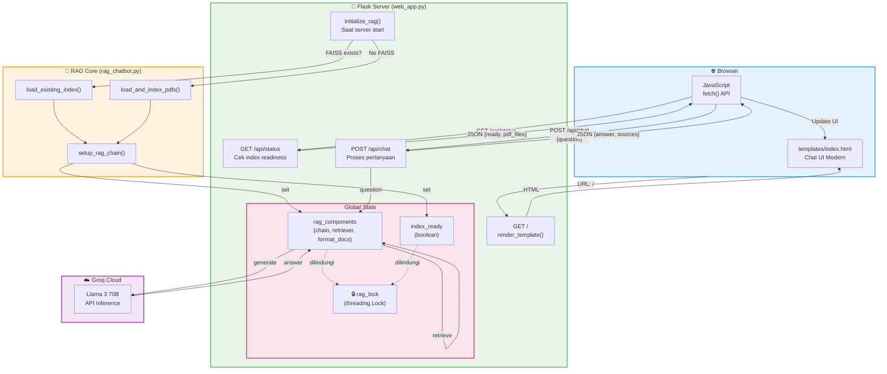

### Global State

#### `rag_components`
- Dictionary yang menyimpan chain, retriever, dan format_docs
- Diinisialisasi sekali saat server start
- Dilindungi oleh `rag_lock` (threading.Lock) untuk keamanan multi-thread

#### `index_ready`
- Boolean yang menandakan apakah index RAG sudah siap
- Diupdate oleh `initialize_rag()`

---

#### `initialize_rag()`

**Deskripsi**: Memuat atau membuat index FAISS, lalu setup RAG chain. Dipanggil sekali saat server start.

**Alur**:
1. Cek apakah `FAISS_INDEX_PATH.exists()`
   - Jika ya: panggil `load_existing_index()` dari `rag_chatbot.py`
   - Jika tidak: panggil `load_and_index_pdfs()` dari `rag_chatbot.py`
2. Setup RAG chain dengan `setup_rag_chain()`
3. Set `rag_components` dan `index_ready = True`
4. Hitung jumlah chunk dari `vector_store.index.ntotal`
5. Jika terjadi error, set `index_ready = False` dan tampilkan pesan

---

#### `index()`

**Route**: `GET /`

**Deskripsi**: Halaman utama chatbot web.

**Return**: HTML yang di-render dari template `templates/index.html`

---

#### `api_status()`

**Route**: `GET /api/status`

**Deskripsi**: Endpoint untuk cek status index RAG.

**Return**: JSON
```json
{
  "ready": true,
  "pdf_files": ["laporan.pdf", "dokumen.pdf"],
  "index_exists": true
}
```

---

#### `api_chat()`

**Route**: `POST /api/chat`

**Deskripsi**: Endpoint utama untuk chatting. Menerima pertanyaan, mengembalikan jawaban + sumber.

**Request Body**:
```json
{
  "question": "Apa isi dokumen ini?"
}
```

**Response**:
```json
{
  "answer": "Dokumen ini membahas tentang...",
  "sources": [
    {
      "file": "laporan.pdf",
      "page": 5,
      "snippet": "Berdasarkan hasil penelitian..."
    }
  ],
  "grounded": true
}
```

**Alur**:
1. Validasi input — pastikan ada field `question`
2. Cek `index_ready` — jika belum siap, return error
3. **Retrieval**: `retriever.invoke(question)`
4. **Generate**: `chain.invoke({"context": context, "question": question})`
5. **Format sources** — mapping metadata ke format JSON
6. Return JSON response

### Diagram Sequence: Request API Chat

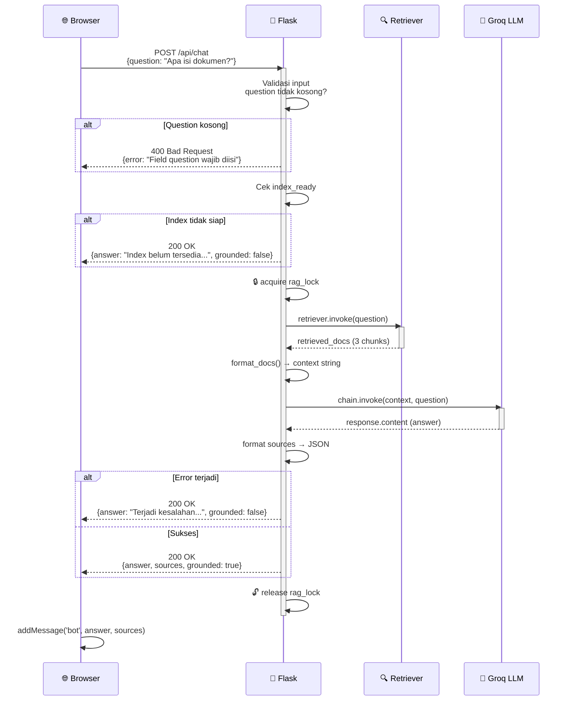

---

## 8. Antarmuka Web (`templates/index.html`)

### 8.1. Struktur HTML

| Elemen | Fungsi |
|--------|--------|
| **Header** | Logo, judul "RAG Chatbot", status badge (Siap/Menyiapkan/Error) |
| **Chat Container** | Area scrollable untuk menampilkan percakapan |
| **Welcome Card** | Kartu selamat datang dengan suggestion chips |
| **Input Area** | Textarea untuk mengetik pertanyaan + tombol kirim |
| **Scroll Anchor** | Elemen pembantu untuk auto-scroll |

### 8.2. Fitur CSS

| Fitur | Detail |
|-------|--------|
| **Desain Modern** | Menggunakan font Inter, gradient, shadow, border-radius |
| **CSS Variables** | Warna dan ukuran konsisten via `:root` variabel |
| **Animasi** | `msgIn` — fade in + slide up untuk pesan baru |
| **Loading Dots** | 3 titik bouncing animasi saat menunggu respons |
| **Responsive** | Breakpoint 600px dan 400px untuk mobile |
| **Custom Scrollbar** | Scrollbar tipis dengan warna muted |
| **Hover Effects** | Tombol, suggestion chip, source toggle — semuanya punya hover state |
| **Dark Mode Ready** | CSS variables memudahkan implementasi dark mode |

### 8.3. Fitur JavaScript

| Fungsi | Deskripsi |
|--------|-----------|
| `checkStatus()` | Panggil `GET /api/status` untuk cek kesiapan index. Dipanggil tiap 15 detik |
| `sendMessage()` | Ambil teks dari input, kirim ke `POST /api/chat`, tampilkan respons |
| `addMessage(type, text, sources, grounded)` | Tambah bubble chat baru ke container |
| `addLoading()` | Tampilkan animasi loading dots |
| `removeLoading()` | Hapus animasi loading |
| `formatTime()` | Format waktu saat ini (HH:MM) |
| `escapeHtml(text)` | Sanitasi HTML untuk mencegah XSS |
| `scrollToBottom()` | Scroll otomatis ke pesan terbaru |
| `toggleSources(el)` | Buka/tutup panel sumber jawaban |

### 8.4. Diagram Alur Web UI

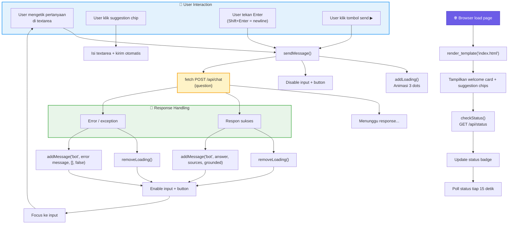

### 8.5. Interaksi Pengguna

1. User mengetik pertanyaan di textarea
2. Alternatif: klik **suggestion chip** untuk pertanyaan cepat
3. Kirim via tombol send atau tekan **Enter** (Shift+Enter untuk baris baru)
4. Loading animation muncul
5. Jawaban muncul di chat bubble
6. Sumber jawaban bisa dibuka/tutup dengan klik "N sumber"
7. Status badge di header selalu update

---

## 9. Penjelasan Detail Teknik

### 9.1. Chunking Strategy

**Mengapa `chunk_size=1000` dan `chunk_overlap=200`?**

| Parameter | Nilai | Alasan |
|-----------|-------|--------|
| `chunk_size` | **1000 karakter** | Model `all-MiniLM-L6-v2` punya limit ~512 token per input. 1000 karakter ≈ 200-250 token (untuk Bahasa Indonesia/Inggris). Cukup untuk menangkap satu paragraf utuh |
| `chunk_overlap` | **200 karakter (20%)** | Memastikan tidak ada konteks yang terpotong di sambungan antar-chunk. Kalimat yang terbelah di akhir chunk akan muncul kembali di awal chunk berikutnya |
| `separators` | `["\n\n", "\n", ".", " ", ""]` | RecursiveCharacterTextSplitter memotong secara hierarkis: paragraf → baris → kalimat → kata. Jauh lebih baik daripada splitter naif yang potong per N karakter |

**Mengapa `RecursiveCharacterTextSplitter`?**

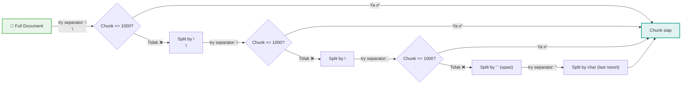

- Memahami struktur teks (paragraf, kalimat)
- Mencoba separator pertama (`\n\n`), jika chunk masih terlalu besar, turun ke separator berikutnya
- Hasil chunk lebih koheren secara semantik

### 9.2. Embedding Model

**Model**: `sentence-transformers/all-MiniLM-L6-v2`

| Properti | Nilai | Penjelasan |
|----------|-------|------------|
| **Dimensi** | 384 | Setiap teks diubah menjadi vektor 384 angka |
| **Ukuran** | ~80 MB | Ukuran model di disk |
| **Kecepatan** | Cepat | Bisa proses ribuan chunk dalam detik |
| **Biaya** | **GRATIS** | Berjalan lokal, tanpa API key, tanpa kuota |
| **Normalisasi** | `normalize_embeddings=True` | Penting agar cosine similarity bekerja optimal |

**Mengapa normalisasi penting?**
- FAISS secara default menggunakan L2 (euclidean) distance
- Dengan normalize_embeddings=True, L2 distance ≡ cosine similarity
- Hasil search lebih akurat secara semantik

### 9.3. Vector Store (FAISS)

| Properti | Nilai | Penjelasan |
|----------|-------|------------|
| **Store** | FAISS | Facebook AI Similarity Search — library vector search terdepan |
| **Search Type** | `similarity` | Mencari chunk berdasarkan kemiripan semantik |
| **Top-K** | 3 | Ambil 3 chunk teratas untuk dikirim ke LLM |
| **Score Threshold** | Tidak digunakan | Strict grounding ditangani oleh prompt LLM, bukan threshold angka |

**Mengapa tanpa `score_threshold`?**
- Model `all-MiniLM-L6-v2` dengan normalisasi menghasilkan skor bervariasi (0.3-0.9)
- Tidak ada nilai threshold universal yang cocok untuk semua dokumen
- Prompt template SUDAH menginstruksikan LLM untuk menjawab "Saya tidak tahu" jika konteks tidak relevan
- LLM lebih baik dalam menilai relevansi daripada threshold angka mati

### 9.4. Strict Grounding

**Apa itu Strict Grounding?**
Strict Grounding adalah prinsip bahwa chatbot **HANYA** boleh menjawab berdasarkan informasi yang ada di dokumen. Jika informasi tidak ditemukan, chatbot harus mengakui ketidaktahuannya.

**Bagaimana implementasinya?**
Strict grounding diimplementasikan **di level prompt**, bukan di level kode.

**Prompt sistem yang digunakan:**
```
Anda adalah asisten AI yang membantu menjawab pertanyaan.
Anda HANYA boleh menjawab berdasarkan konteks dokumen yang diberikan.
JANGAN menggunakan pengetahuan umum Anda sendiri.

ATURAN KETAT:
1. Jawablah pertanyaan dengan bahasa Indonesia yang baik dan benar.
2. Jawablah HANYA berdasarkan konteks di bawah ini.
3. Jika jawaban tidak dapat ditemukan dalam konteks, katakan dengan
   tegas: "Saya tidak tahu. Informasi tersebut tidak tersedia dalam
   dokumen yang diberikan."
4. JANGAN membuat informasi yang tidak ada dalam konteks.
5. JANGAN menggunakan pengetahuan Anda di luar konteks.
```

**Mengapa di prompt, bukan di filter kode?**

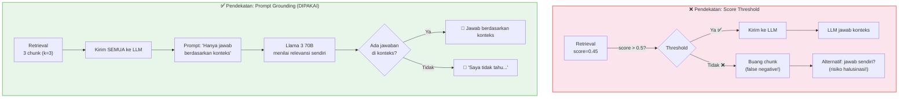

**Keuntungan Prompt Grounding:**
- LLM modern (Llama 3 70B) sangat baik dalam mengikuti instruksi
- Filter threshold sering salah positif (anggap relevan padahal tidak)
- Filter threshold sering salah negatif (anggap tidak relevan padahal ada)
- Prompt lebih fleksibel untuk berbagai jenis pertanyaan

### 9.5. Source Citation

**Tujuan**: Transparansi — user bisa melihat dari mana jawaban berasal.

**Informasi yang ditampilkan per sumber:**
1. **Nama file** — dokumen asal
2. **Nomor halaman** — halaman spesifik (0-indexed dari PyPDF → ditambah 1)
3. **Cuplikan teks** — 150-200 karakter pertama dari chunk

**Implementasi di Terminal:**
```python
def format_sources(retrieved_docs) -> str:
    # Format: [1] file.pdf | Halaman 5
    #         Kutipan: "teks..."
```

**Implementasi di Web:**
- Sumber ditampilkan sebagai kartu yang bisa dibuka/tutup
- Ada toggle "N sumber" yang bisa diklik
- Setiap sumber punya icon, nama file, halaman, dan cuplikan

**Tampilan di Web:**

```
┌───────────────────────────────────────────────┐
│  ▶ 3 sumber                                   │ ← klik untuk expand
│                                               │
│  ┌───────────────────────────────────────┐    │
│  │ 📄 laporan.pdf — Halaman 5            │    │
│  │ "Berdasarkan hasil penelitian yang    │    │
│  │  dilakukan selama 3 bulan..."         │    │
│  └───────────────────────────────────────┘    │
│                                               │
│  ┌───────────────────────────────────────┐    │
│  │ 📄 laporan.pdf — Halaman 6            │    │
│  │ "Data menunjukkan peningkatan yang    │    │
│  │  signifikan pada kuartal ketiga..."   │    │
│  └───────────────────────────────────────┘    │
└───────────────────────────────────────────────┘
```

---

## 10. Cara Instalasi & Konfigurasi

### 10.1. Prasyarat

- Python 3.9+
- pip (Python package manager)

### 10.2. Diagram Alur Instalasi

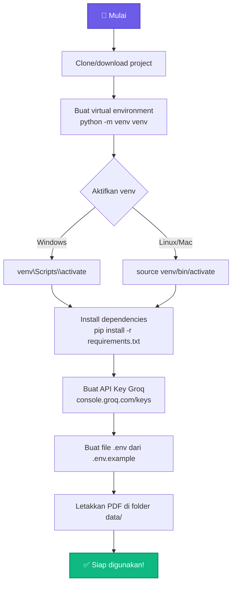

### 10.3. Langkah Instalasi

```bash
# 1. Clone atau download project
# (sudah dilakukan)

# 2. Buat virtual environment
python -m venv venv

# 3. Aktifkan virtual environment
# Windows:
venv\Scripts\activate
# Linux/Mac:
source venv/bin/activate

# 4. Install dependencies
pip install -r requirements.txt

# 5. Setup API key Groq
# - Buka https://console.groq.com/keys
# - Klik "Create API Key"
# - Salin API key
# - Buat file .env dari .env.example:
cp .env.example .env
# - Isi GROQ_API_KEY di file .env

# 6. Siapkan PDF
# Letakkan file PDF di folder data/
cp /path/to/dokumen.pdf data/
```

### 10.4. File `.env`

```env
GROQ_API_KEY=gsk_xxxxxxxxxxxxxxxxxxxxxxxxxxxxxxxxxxxxxxxx
```

---

## 11. Cara Menjalankan

### 11.1. Mode Terminal

```bash
python rag_chatbot.py
```

**Diagram Alur Terminal:**

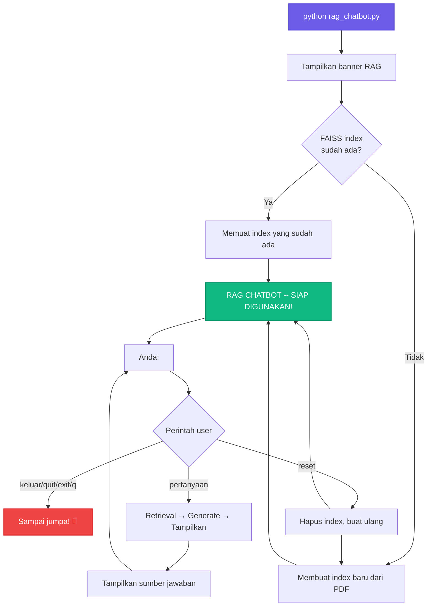

**Fitur Mode Terminal:**
- Loop percakapan interaktif
- Perintah `keluar` untuk berhenti
- Perintah `reset` untuk reload index
- Source citation langsung di terminal

### 11.2. Mode Web

```bash
python web_app.py
```

Lalu buka browser: **http://127.0.0.1:5000**

**Fitur Mode Web:**
- Antarmuka chat modern
- Suggestion chips
- Loading animation
- Source citation expandable
- Auto-scroll
- Responsive (mobile friendly)
- Status badge real-time

---

## 12. Endpoint API

### 12.1. `GET /api/status`

Cek status index dan informasi dasar.

**Response:**
```json
{
  "ready": true,
  "pdf_files": ["contoh.pdf"],
  "index_exists": true
}
```

| Field | Tipe | Deskripsi |
|-------|------|-----------|
| `ready` | boolean | Apakah index siap digunakan |
| `pdf_files` | array of string | Daftar file PDF di folder data/ |
| `index_exists` | boolean | Apakah file index FAISS ada |

### 12.2. `POST /api/chat`

Kirim pertanyaan dan terima jawaban.

**Request:**
```json
{
  "question": "Apa isi dokumen ini?"
}
```

**Response Sukses:**
```json
{
  "answer": "Dokumen ini membahas tentang...",
  "sources": [
    {
      "file": "contoh.pdf",
      "page": 1,
      "snippet": "Isi dokumen..."
    }
  ],
  "grounded": true
}
```

| Field | Tipe | Deskripsi |
|-------|------|-----------|
| `answer` | string | Jawaban dari chatbot |
| `sources` | array of object | Daftar sumber |
| `sources[].file` | string | Nama file PDF |
| `sources[].page` | int | Nomor halaman (1-indexed) |
| `sources[].snippet` | string | Cuplikan teks (200 karakter) |
| `grounded` | boolean | Apakah jawaban ditemukan di dokumen |

**Response Error:**
```json
{
  "error": "Field 'question' wajib diisi"
}
```

### Contoh Penggunaan via curl:

```bash
# Cek status
curl http://127.0.0.1:5000/api/status

# Kirim pertanyaan
curl -X POST http://127.0.0.1:5000/api/chat \
  -H "Content-Type: application/json" \
  -d '{"question":"Apa isi dokumen?"}'
```

---

## 13. Troubleshooting

| Masalah | Penyebab | Solusi |
|---------|----------|--------|
| `GROQ_API_KEY not found` | File `.env` tidak ada atau salah | Buat file `.env` dari `.env.example` dan isi API key |
| `No module named ...` | Dependency belum terinstall | `pip install -r requirements.txt` |
| `No PDF files found` | Folder `data/` kosong | Letakkan minimal 1 file PDF |
| Index corrupt | File FAISS rusak | Hapus folder `faiss_index/` lalu restart |
| Ingin re-index | Update PDF | Hapus `faiss_index/` atau ketik `reset` di chatbot |
| Server error di web | Index belum siap | Pastikan ada PDF dan API key valid |
| Jawaban tidak relevan | Kualitas chunk/chunking | Coba variasi chunk_size/chunk_overlap |

### Diagram Troubleshooting

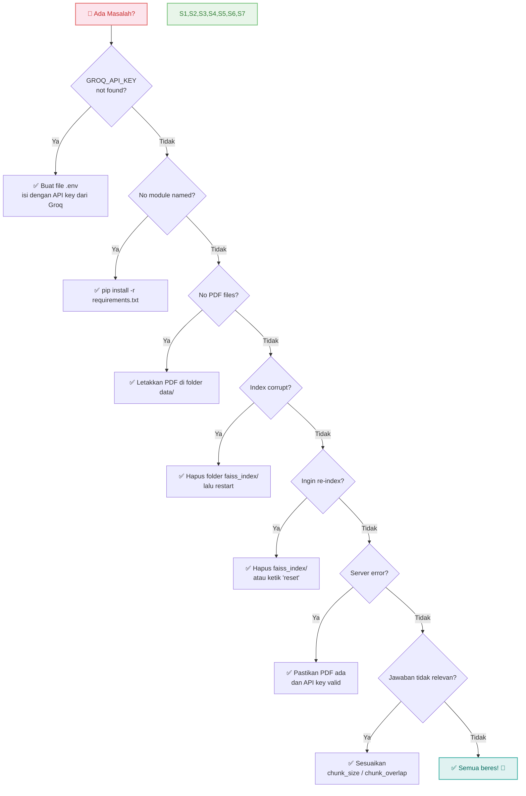

---

## Referensi

- [LangChain Documentation](https://python.langchain.com/)
- [Groq Console](https://console.groq.com/)
- [HuggingFace all-MiniLM-L6-v2](https://huggingface.co/sentence-transformers/all-MiniLM-L6-v2)
- [FAISS Documentation](https://faiss.ai/)
- [Flask Documentation](https://flask.palletsprojects.com/)
- [Mermaid Documentation](https://mermaid.js.org/)

---